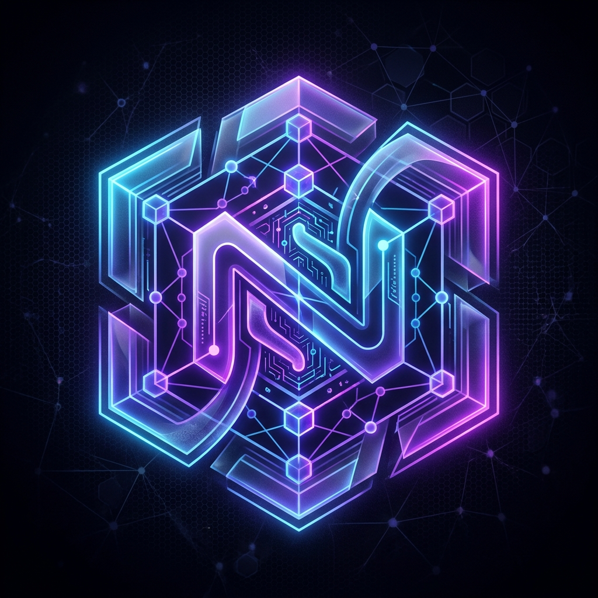
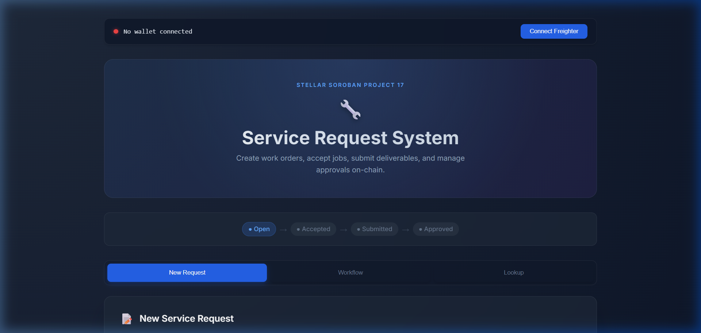

# Nero Chain Service Request System

<p align="center">
  
</p>

    

A next-generation decentralized application (dApp) built on the Nero Chain using EVM Smart Contracts (Solidity). This interface enables users to seamlessly create work orders, accept and submit deliverables, and manage final on-chain approvals with zero centralized infrastructure.

CONTRACT_ADDRESS = "0x8d2695a6a0f8cf928f76E0407C166ea6aeA691C0"

## 📸 Visual Tour


### Main Dashboard & Request Creation


## 🌟 Key Features

- **Decentralized Service Escrow**: Create non-custodial work requests with an attached Nero tokens budget safely locked by the smart contract.
- **Provider Workflow**: Decentralized mechanism for service providers to pick up open requests and submit comprehensive deliverables upon task completion.
- **On-chain Approvals**: Requesters retain sovereign authority—able to approve or reject the work through purely cryptographic signatures.
- **Flawless UI/UX**: The UI ditches generic templates for a custom, glassmorphic layout powered by the robust GreenSock Animation Platform (**GSAP**) providing immersive 3D tilting and rapid micro-animations.
- **Intelligent Error Handling**: Opaque EVM revert errors are intercepted during the RPC interaction phase and presented as beautifully styled, actionable alerts—delivering a frustration-free UX.

## 🚀 Getting Started

Follow these instructions to run the Service Request dApp locally.

### 1. Prerequisites
- **Node.js**: Ensure you have Node `v18+` or newer installed.
- **MetaMask Wallet**: Install the [MetaMask browser extension](https://metamask.io/) and configure it for the Nero Chain Testnet.

### 2. Installation
Clone the repository and install the dependencies inside the `my-nero-app` directory:

```bash
git clone https://github.com/your-username/service-request.git
cd service-request
cd my-nero-app
npm install
```

### 3. Run the Development Server
Fire up the Vite hot-reloading dev server:

```bash
npm run dev
```

Visit the `localhost` URL printed in your terminal (typically `http://localhost:5173`).

### 4. Constructing for Production
To build your project:
```bash
npm run build
```
This runs the Vite compiler to produce hyper-optimized, minified vanilla assets inside the `/dist` output directory.

## 🏗 System Architecture

Our dApp follows a perfectly decoupled, 5-layer decentralized architecture:

1. **User Layer**: The entry point where users visually interact with the platform natively through their Client Browser.
2. **Frontend Layer**: 
    - A localized React Single Page Application (SPA), primarily modeled around `App.jsx`.
    - Handles **State & Navigation** locally for instantaneous DOM transitions entirely devoid of server routing delays.
    - Utilizes a localized **GSAP + 3D Transform Engine** to interpret UI Events and deliver an immersive, polished component experience.
    - Features smart **Output Panel** state management that beautifully renders query structures and outputs accurately.
3. **Wallet Layer**: Operates as a cryptographic bridge, executing Wallet Auth Requests securely through the **MetaMask Wallet** application to prompt password confirmation, generating Signed Transactions payload drops.
4. **Integration Layer** (`lib/nero.js`): The orchestrator that manages all RPC interaction pipelines via ethers.js.
    - **Write Operations**: Actions like `createRequest`, `acceptRequest`, `submitWork`, and `approveWork` compile user intent into EVM transactions, attaching gas and simulation footprints, before routing to the network.
    - **Read Operations**: Polling triggers like `getRequest` simulate read-only execution runs against the blockchain to fetch the most cutting-edge block state.
    - **Error Translation Layer**: Built-in regex listeners catching `revert` footprints, actively parsing VM exceptions into beautifully mapped validation prompts.
5. **Blockchain Layer (Nero Testnet)**: Final decentralized execution layer. Global nodes validate the transaction against the compiled **Service Request Smart Contract** which securely locks budgets, maintains order ledgers securely, and finalizes mutations.

## 📂 Project Structure

```
service-request/
├── my-nero-app/                 # Core UI and Logic directory
│   ├── src/                     # React application sources
│   │   ├── LandingPage.jsx      # High-fidelity entrance page
│   │   ├── App.jsx              # Mission control SPA router
│   │   ├── App.css              # Global custom CSS design system
│   │   └── assets/              # Architecture diagram & visual embeddings
│   ├── lib/                     # Ethers.js RPC Bridge
│   │   └── nero.js              # Integration mapping and exception parsing limits
│   ├── package.json             # NPM metadata and scripts
│   └── vite.config.js           # Module configuration and Github pages base mapping
```

## 📜 License
MIT License
